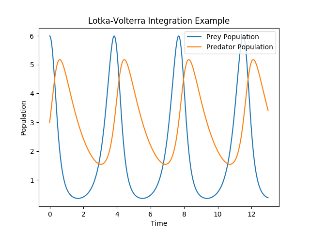
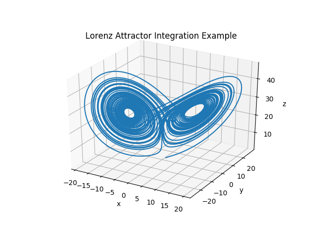

# Runge Kutta ODE Solver

<p>
  
   
</p>

This tiny header only C++ library provides very easy to use [Runge-Kutta solvers](https://en.wikipedia.org/wiki/Runge%E2%80%93Kutta_methods) for ordinary differential equations.


# STILL UNDER CONSTRUCTION

It features:

- Explicit solvers
- Implicit solvers
- A wide range of built in Runge-Kutta methods.
- Very easy implementation of custom methods. The solvers can implement any provided Butcher scheme.

## Table of Contents

  * [Usage](#usage)
  * [Built-in Methods](#built-in-methods)
    * [Explicit Methods](#explicit-methods)
    * [Implicit Methods](#implicit-methods)
  * [Installation](#installation)
  * [What the Code does not provide!](#what-the-code-does-not-provide!)
  * [Background of this Project](#background-of-this-project)
  * [Sources](#sources)
  * [License](#license)


## Usage

This section has two parts:

1. How do I prepare a problem for it to be solved in the RK solver.
2. How do I actually use the solver.

### 1. Perparing a problem

Assume we have an ordinary differential equation f with y' = f(y). For explicit solvers y can be any Eigen datatype whereas for implicit solvers y must be of type `Eigen::VectorXd`. Note that if the differential equation is one dimensional e.g. f(x) = x we just use a onedimensional vector.

In the example below f implementes the so called Lotka-Volterra differential equation as a lambda function (though you can also use normal functions).

Now we must specify some additional details: We need to know what our initial conditions are, denoted `y0` below, as well as the time interval we are solving over, 20 time units in the example below.

Last but not least, we have to tell the solver how many steps it should take. Very vaguely for explicit methods more steps is better.

```
unsigned int steps = 100;
unsigned int time = 20;

auto f = [] (Eigen::VectorXd y) {
  Eigen::VectorXd df(2);
  df << y(0)*(3-0.7*y(1)) , -y(1)*(0.7-0.8*y(0));
  return df;
};

Eigen::VectorXd y0(2);
y0 << 6,2;
```

### How do I actually use the solver.

This is super simple, for an explicit built in solver we just pass the required four parameters:

```
std::vector<Eigen::VectorXd> results = ExplicitRKSolvers::classical4thOrderRuleIntegrator(f, time,y0, steps);
std::cout << "The classical 4th order Runge-Kutta method gives us" << results.back().transpose() << std::endl;
```

The method returns an `std::vector` where every element in the vector is the result of a single Runge-Kutta step. The last one is the result of the whole integration.

If you want to use your custom Butcher's table this is simple too, just supply it to the `ExplicitRungeKuttaIntegrator`:

```
Eigen::MatrixXd A(3,3);
A << 0, 0, 0,
      1, 0, 0,
      1.0/4,1.0/4,0;
Eigen::VectorXd b(3);
b << 1.0/6, 1.0/6, 2.0/3;

ExplicitRungeKuttaIntegrator<Eigen::VectorXd> Solver(A,b);
std::vector<Eigen::VectorXd> y2Vec = Solver.solve(f,2,y0,10);

std::cout << "SSPRK3 3rd order Runge-Kutta method gives us = " << y2Vec[10].transpose() << std::endl;
```

## Built-in Methods

### Explicit Methods

| **Method Name** | **Order of Convergence** |
|-----------------|-----------|
|      `explicitEulerRule`            |     1      |
|`explicitTrapezoidalRule`|               2  |
|        `explicitMidPointRule`          |  2         |
|             `classical4thOrderRule`    |   4        |
|`kuttas38thRule`| 4 |

### Implicit Methods

| **Method Name** | **Order of Convergence** | **Stability Guarantees**
|-----------------|-----------|----------------|
|      `implicitEulerRule`   |     1    | none |
|`implicitMidpointRule`|    2  | none |
|   `radauRKSSMRule3`   |  3    | L-stable |
|  `radauRKSSMRule5`   |   5   | L-stable |


## Installation

**Installing Eigen**

Make sure you have Eigen installed: This can easily be done using your packet manager:

- on Debian based systems: `sudo apt install libeigen3-dev`
- on RPM based systems: `sudo dnf install eigen3-devel`

**Running Eigen**

To run the code you very likely have to tell your C++ compiler where it can find eigen. For example: `g++ -I /usr/include/eigen3 myFile.cpp`

## What the Code does not provide!

The code comes with ABSOLUTELY NO WARRANTY. See the [license](./LICENSE) for more information.

The code implements Runge Kutta methods but does not check if a solution blow up occurs. It does not (yet) feature any adaptive integration. It is your job to select the right Runge-Kutta method (e.g. A-stable, L-stable etc.).

## Background of this Project

In fall of 2019 I took the class "Numerical Methods for CSE" taught by Prof. Hiptmair at ETH Zürich. Having been fascinated by the stability (as well as instability) of Runge-Kutta methods I have written this tiny library. Since this code might be useful for others too I published it on GitHub.

## Sources

- Implementation details have been taken from [Prof. Hiptmair's](https://math.ethz.ch/sam/the-institute/people/ralf-hiptmair.html) [lecture notes](https://www.sam.math.ethz.ch/~grsam/NCSE19/NumCSE_Lecture_Document.pdf) as well as homeworks.

## License

See the [license](./LICENSE) file in this repository.
