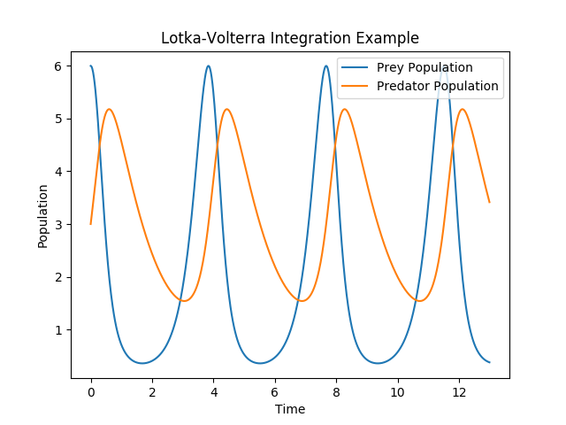

# Demo: Solving and Plotting  ODEs

## Short Explanation

### Lotka-Volterra

The [Lotka-Volterra ordinary differential equation (ODE)](https://en.wikipedia.org/wiki/Lotka%E2%80%93Volterra_equations) can be used to model the interaction between two species. 

In this example we have defined a function `f` which takes a state `y0` and calculates the change in population according to the Lotka-Volterra Model. 

Please note that I am not a biologist, hence the constants I picked in the equation might highly unrealistic.

### Lorenz Attractor

Will follow soon.

## How to Run the Example

The project depends on [Eigen]() as well as [Matplotlib-Cpp](https://github.com/lava/matplotlib-cpp).

Note that Matplotlib-Cpp uses Python 2, this isn't ideal but it is still a very good and lghtweight plotting library:

### Fetch the Requires Packages

To fetch the dependencies for Matplotlib-Cpp install the following packages (on debian systems for example) `sudo apt-get install python-matplotlib python-numpy python2.7-dev`.

### Compile the File

Having installed the prerequisites for Matplotlib-Cpp we can now compile our `demo.cpp` file using `g++ -I /usr/include/eigen3 -I /usr/include/python2.7  demo/demo.cpp -lpython2.7`. This of course assumes that you have an Eigen3 installation at `/usr/include/eigen3 `. Alternatively, if you have cloned the whole project, you can run `make demo` and let `Make` compile the demo for you.
